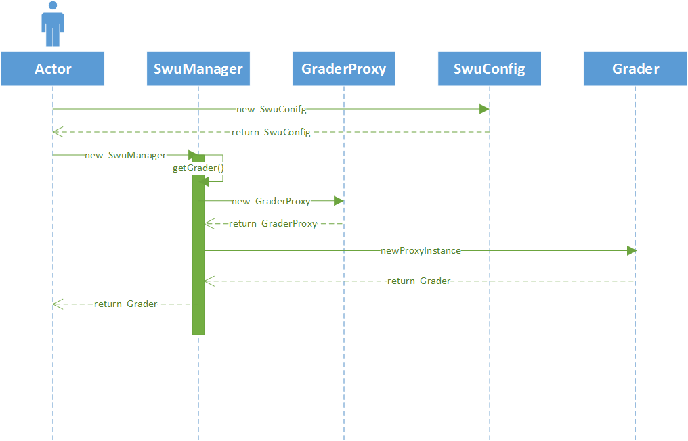

# JSwu开发者文档
## 目录
- [时序图](#pic_uml)
- [依赖图]()
- 模块
  - [缓存](#module_cache)
  - [连接器](#module_connection)
  - [成绩](#module_grade)
  - [公共基础包](#module_common)
## <span id="pic_dependency">依赖图</span>


## <span id="pic_uml">时序图</span>



上图是以成绩模块为例的对象初始化和调用过程，其他功能模块同理。

相信你已经在上图中发现了很大的问题，那就是具体模块（图中为成绩模块）的实现，依赖了连接器！我们这样做的理由是：具体的功能模块中，的确需要一个http客户端。没有办法抛开http完成任何功能，因为具体的功能模块必然要与学校的系统交互。

## <span id="module_cache">缓存:JSwu-cache</span>


## <span id="module_connection">连接器：JSwu-connection</span>

## <span id="module_grade">成绩：JSwu-grade</span>
成绩模块封装了与教务系统查询成绩有关的实现，JSwu内置了默认的实现，见JSwu-grade-simple模块。如何使用自己实现的成绩查询模块呢？只需要实现JSwu-grade中的接口来实现自己的成绩查询模块，然后在创建SwuConfig时，传入自己实现的成绩查询模块即可，如下所示：
```java
        // 使用setGraderFactory传入自己的成绩工厂实现
        // 默认的成绩工厂为 SimpleGraderFactory，无须显式传入
        SwuConfig swuConfig = new SwuConfig.Builder("your_swuid", "password")
                .setGraderFactory(new YourGraderFactory())
                .build();
```

## <span id="module_common">公共基础包：JSwu-common</span>